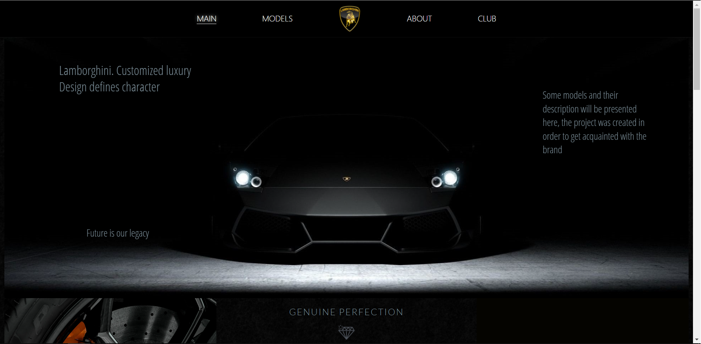
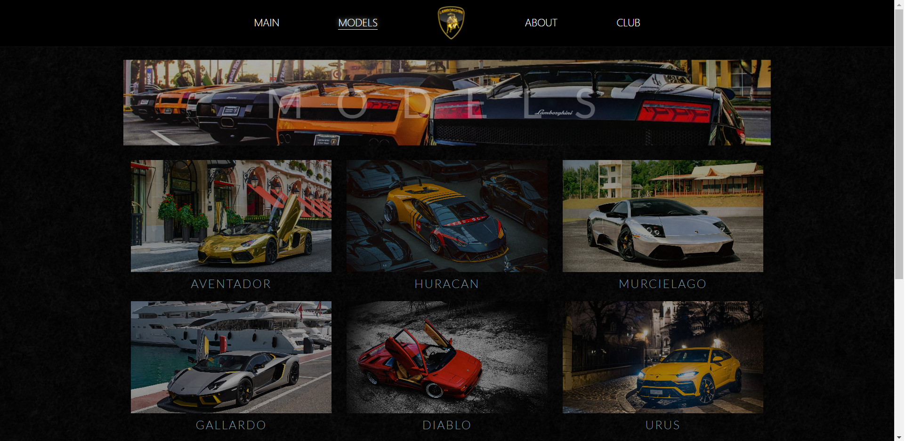
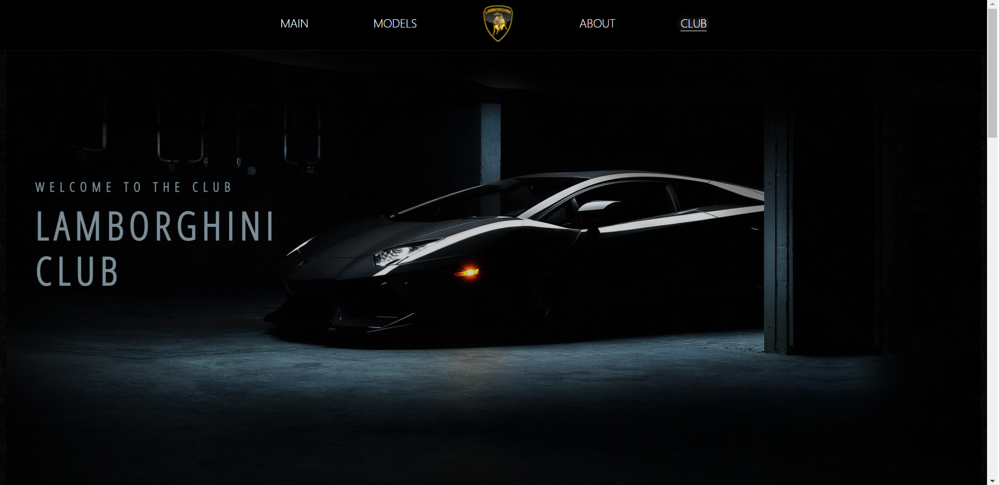

# Lamborghini Catalog

A multi-page site for Lamborghini lovers, which contains the most diverse information.



The entire range is provided in the section with models.



Special section for club members.



## Features/highlights

-   multipage site
-   almost everything is written in HTML and CSS
-   javascript is used only for the functionality of the burger menu and for the implementation of sending data from the form to the server
-   json-server is used to emulate work with the server

## Setup

```bash
$ git clone https://github.com/YuriDubinin/LamboClub.git
$ cd LamboClub
$ npx json-server db.json
```
